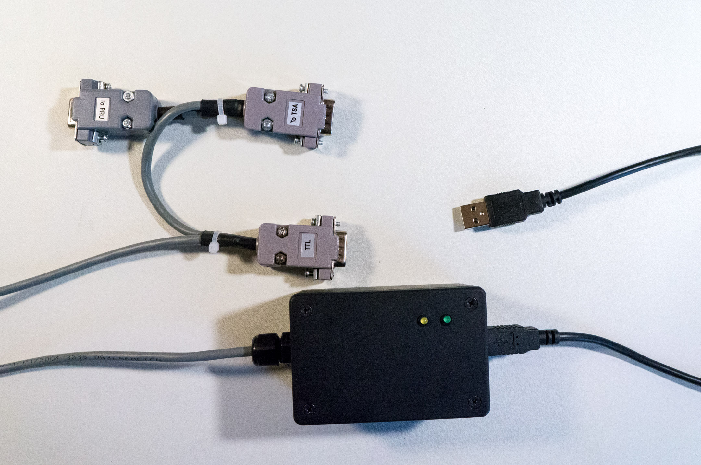

# TSA-to-USB Adapter

This project allows computers to communicate with the [Medoc TSA II](http://www.medoc-web.com/products/tsa-ii) using a serial protocol sent over a USB port.




## Quick-start

You should also read the the TSA II operation manual (TSA2OperationManual.pdf) to learn how to build TSA programs that send and receive TTL signals.


### Setup

**OSX and Linux**

Plug the adapter into the computer with a USB cord. You may initially get prompts to set up a keyboard or a networking device. Accept the changes and you shouldn't be prompted again.

To verify that the device is available:

* Open the Terminal
* run `ls /dev | grep usb`
* this should return one tty port, for example `/dev/tty.usbmodem411`.

**Windows**

Plug the adapter into the computer with a USB cord. In tests on Windows 7, the computer automatically searched for and installed drivers with no additional work needed.

To verify that the device is available:

* Open the Device Manager
* Look for an entry in the tree: Ports (COM & LPT) > Arduino Micro (COM*N*)

If the drivers did not install successfully in the prior step, you may need to install them manually. For help, try following [these instructions](https://learn.sparkfun.com/tutorials/pro-micro--fio-v3-hookup-guide#installing-windows).


### TSA Software

Open the Hardware Settings dialog in the TSA software to make sure communication is working. Here you can send and receive test pulses.

*NOTE - While the Medoc TSA purports to accept TTL pulse inputs, we have not been able to get it to work.*


### LED feedback

* plug in to computer - green LED will turn on
* `connect()` from the computer - green LED will flash once
* `trigger()` a TTL pulse from the computer - yellow LED will flash once
* receive a TTL pulse from the TSA - yellow LED will flash twice


## Programming in MATLAB

Note that MATLAB will not see the adapter unless it is plugged in when MATLAB starts.

You'll need access to *matlab/TSAAdapter.m* in your program.


### API

**`tsa = TSAAdapter()`**

Constructor - returns a new TSA object. This only needs to be done once at the beginning of your program.

**`tsa.connect()`**

Establish a connection with the adapter. This only needs to be done once at the beginning of your program.

**`tsa.trigger()`**

Send a TTL pulse to the TSA. *NOTE - While the Medoc TSA purports to accept TTL pulse inputs, we have not been able to get it to work.*

**`tsa.check()`**

Return `1` (true) if a TTL pulse was sent by the TSA since the last time `check()` was called; return `0` (false) otherwise. If multiple pulses are sent, `check()` will still only return a `1`.

**`tsa.disconnect()`**

Drop the connection with the adapter. This is optional, as the connection will be automatically dropped when your script ends.


### Example

Basic usage is as follows:

```
>> tsa = TSAAdapter()
>> tsa.connect()
>> tsa.trigger()  % sends a pulse to the TSA
>> tsa.check()    % has a pulse been received since last check?
false
>> tsa.check()
false
>> tsa.check()
true
>> tsa.check()
false
>> tsa.disconnect()
```


## Programming in Python

These notes only apply if you're writing a program in Python - not MATLAB.

The Python helper requires `pyserial` to be installed. This can be obtained by running `pip install pyserial` from the command-line.

You'll need to import the *python/tsa.py* file into your program.


### API

**`import tsa`**

Import the TSA module. This only needs to be done once at the beginning of your program.

**`tsa.connect()`**

Establish a connection with the adapter. This only needs to be done once at the beginning of your program.

**`tsa.trigger()`**

Send a TTL pulse to the TSA.

*NOTE - While the Medoc TSA purports to accept TTL pulse inputs, we have not been able to get it to work.*

**`tsa.check()`**

Return `True` if a TTL pulse was sent by the TSA since the last time `check()` was called; return `False` otherwise. If multiple pulses are sent, `check()` will still only return `True`.

**`tsa.wait()`**

Block execution until a TTL is sent by the TSA.

**`tsa.disconnect()`**

Drop the connection with the adapter. This is optional, as the connection will be automatically dropped when your script ends.


### Example

Basic usage is as follows:

```
>>> import tsa
>>> tsa.connect()
>>> tsa.trigger()  # sends a pulse to the TSA
>>> tsa.wait()     # this call will block until a pulse is received
True
>>> tsa.check()    # has a pulse been received since last check?
False
>>> tsa.check()
False
>>> tsa.check()
True
>>> tsa.check()
False
>>> tsa.disconnect()
```


## Implementation Details

### Theory of Operation

The TSA can send and receive signals via very simple pulses of electricity, called TTL signals. For example, a pulse could signal the TSA to start a test, or the TSA could send a pulse when the user clicks the mouse. Refer to the TSA operation manual (TSA2OperationManual.pdf) for more information on creating TSA programs that send and receive pulses.

Most personal computers do not have the ability to use raw TTL pulses, so this adapter was made to allow programs (e.g. MATLAB or Python) to interact with the TSA. The adapter works by translating TTL signals to serial port messages and vice-versa. The serial port messages are then sent over a USB cable to the computer.


### Serial Protocol

The MATLAB and Python helper libraries implement the logic described below. However, you may be interested in implementing the logic differently; for example if more precise timing is required, then it might be implemented inside a thread (Python) or using event-driven callbacks (MATLAB). It can also be implemented in another programming language.

With the adapter plugged into the computer, have your program or terminal program open a serial port on `/dev/tty.usbmodem411` at 9600 bps.

The adapter communicates with the computer via a simple pair of messages:

* To instruct the adapter to send a pulse to the TSA, send a `*` character over the serial port from the computer.
* When the TSA sends a pulse, a `#` character will be sent from the adapter to the computer over the serial port.

Writing programs to read and write serial port messages is straightforward, and libraries are available in most languages. You can also use a serial terminal program like [CoolTerm](http://freeware.the-meiers.org/) or [screen](https://embeddedfreak.wordpress.com/2008/08/12/using-gnu-screen-to-debug-your-serial-port/) to experiment with the serial port without writing any code.

### Hardware

The adapter is built around an Arduino-compatible microprocessor board, the [SparkFun Pro Micro](https://www.sparkfun.com/products/12640). More information about how it's put together is contained in the *hardware* directory and the *readme.md* file there.


## Copyright

Written and built by Devon Rueckner for [Carissa Cascio at the Vanderbilt University Medical Center](http://www.casciolab.com/).
